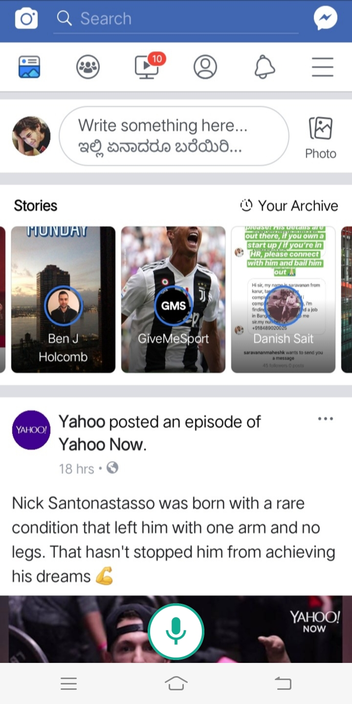
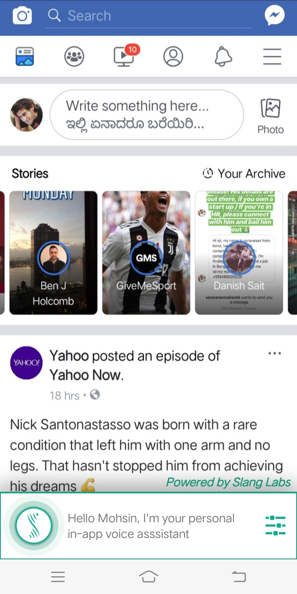

# FacebookMock app
This app is the mocked version of the Facebook App developed to demonstrates integration and working of slang voice interface.

  

This app allows 5 primary functionality -

* Home feed page
  - Triggered by the user saying things like "show my feed"
  
* User profile page
  - Triggered by the user saying "Show my profile"
  
* Company Page
  - Triggered by the user saying "show slanglabs page"
  
* Payment setting
  - Triggered by the user saying "manage payment" or "show payment method"

* Language setting
  - Triggered by the user saying "change language"
  
The app works by having "static" screenshots of the above functionality and the app switching to an activity which picks the appropriate screenshot based on the functionaltiy triggered

The code that sets the "functionality" is in https://github.com/SlangLabs/fbmock/blob/master/app/src/main/java/in/slanglabs/facebookmock/SlangVoiceInterface.java

This is the main code that handles all the voice interactions. Demonstrates how to initialize slang and register for actions

